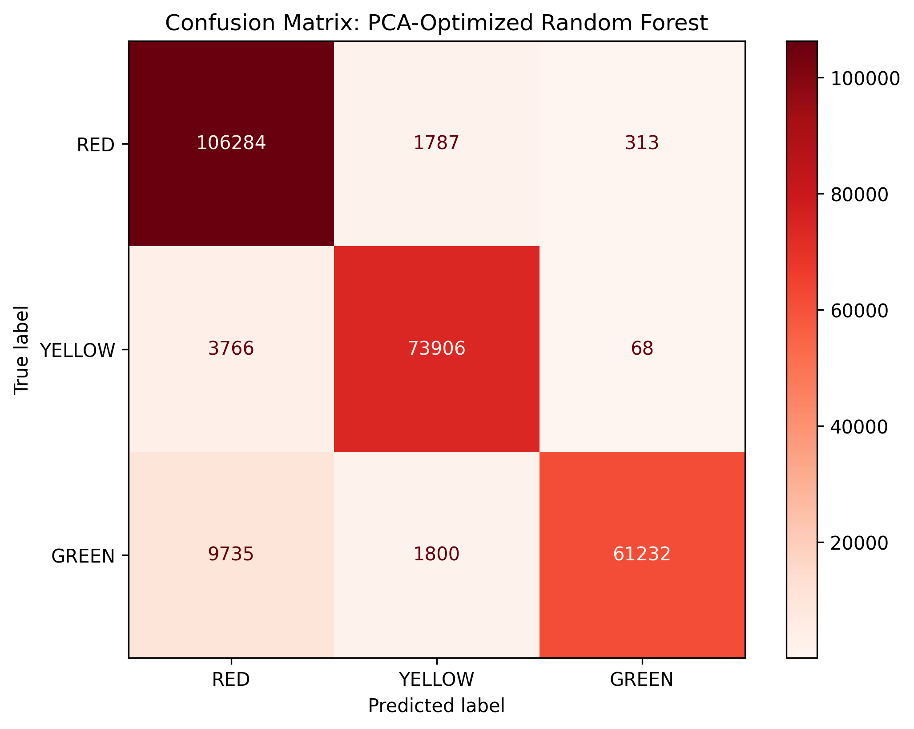

# Automating Emergency Room Triage: A Distributed PCA-Optimized Random Forest Classifier in PySpark

### Project Overview
Traditional manual triage in Emergency Rooms is highly susceptible to bottlenecks, clinician fatigue, and human error. During sudden patient influxes, subtle yet life-threatening conditions risk misclassification, endangering patients and straining hospital resources. To address this operational challenge, we propose an Automated ER Triage Optimizer. 

By enabling symptom self-reporting, our system leverages a scalable PySpark-based Big Data pipeline to efficiently process complex relational medical data and categorize cases into standard RED, YELLOW, or GREEN priority levels. Overcoming the computational memory constraints of high-dimensional symptom matrices, we integrated Principal Component Analysis (PCA) to compress the feature space and prevent algorithmic overfitting. We then engineered a distributed Random Forest classifier trained on this optimized synthetic medical dataset.

### The Dataset
The project utilizes the Symptoms-to-Diseases Medical dataset, a synthetic medical diagnosis dataset designed to support the development and evaluation of machine learning models for symptom-based disease prediction. 
* It is derived from the DDXPlus dataset.
* Because the data is synthetic, it does not contain real patient identities.
* The study focuses exclusively on the three interconnected subsets essential for our triage classification pipeline: `patients`, `patient_evidences`, and `diseases`.

### Relational Database Schema
The schema of our database is centered around the `patients` table. This central table maintains a one-to-many relationship with the `patient_evidences` table, linked via the shared `patient_id` key. This structure allows a single patient record to be associated with an array of multiple symptoms and a list of several candidate diagnoses. 

The main challenge in joining `patients_df` with `patient_evidences_df` is the "exploding join"; because a patient exhibits multiple symptoms, a standard join duplicates their demographic data across many rows. To resolve this, we use PySpark to group all symptoms into a single array for each patient. There are exactly 1,292,579 records in the finalized master dataset.

### Data Preprocessing & Feature Engineering
* **Column Pruning:** Strict column pruning was applied across DataFrames to prevent data leakage, removing any information a triage nurse does not possess when a patient first arrives.
* **Label Encoding:** The 1 to 5 severity indices were binned into three standard priority classes: RED with a value of 4 or 5, YELLOW with a value of 3, and GREEN with a value of 1 or 2.
* **Vectorization:** A `CountVectorizer` was initially utilized to transform the arrays of symptoms into mathematical matrices.
* **Dimensionality Reduction:** To solve the computational bottleneck of highly sparse matrices, PCA was introduced to shrink the massive feature space into a much smaller set of 50 dense principal components.

### Model Performance
Three distinct classification algorithms were evaluated to handle the data: Logistic Regression, Decision Tree Classifier, and Random Forest Classifier. 

By building an ensemble of 50 independent decision trees, the Random Forest aggregates their individual predictions via a majority vote. This ensemble approach inherently resists overfitting, smoothly handles non-linear symptom relationships, and leverages the dense PCA components to provide highly stable, generalized triage predictions.

| Model | Accuracy | Precision | F1-Score |
| :--- | :--- | :--- | :--- |
| Uncompressed Random Forest | 0.817 | 0.837 | 0.817 |
| PCA-Optimized Decision Tree | 0.856 | 0.863 | 0.856 |
| **PCA-Optimized Random Forest** | **0.933** | **0.937** | **0.932** |

The proposed model successfully generalized clinical patterns, achieving a robust 93.3% overall accuracy and an F1-Score of 0.933.

### Clinical Safety & Confusion Matrix
In a clinical triage setting, the severity of a misclassification is not uniform. The confusion matrix reveals a critical clinical advantage of our proposed model: it exhibits an exceptionally low rate of fatal RED misclassifications. 

The model successfully prioritizes patient safety by rarely under-triaging, i.e., misclassifying a critical RED patient as a non-urgent GREEN patient. While the matrix indicates a higher rate of over-triaging, this asymmetric error distribution is highly desirable in emergency medicine. It proves that the PCA-Optimized Random Forest Classifier has safely mapped the most severe clinical patterns, effectively minimizing the risk of life-threatening clinical oversight.

